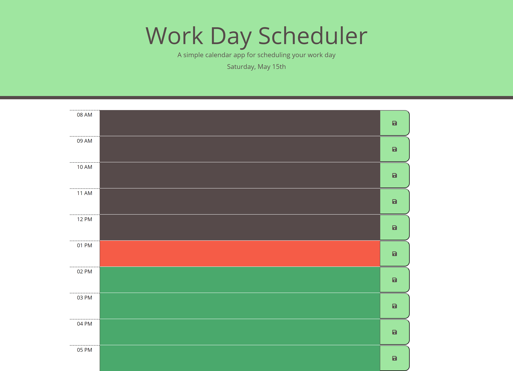
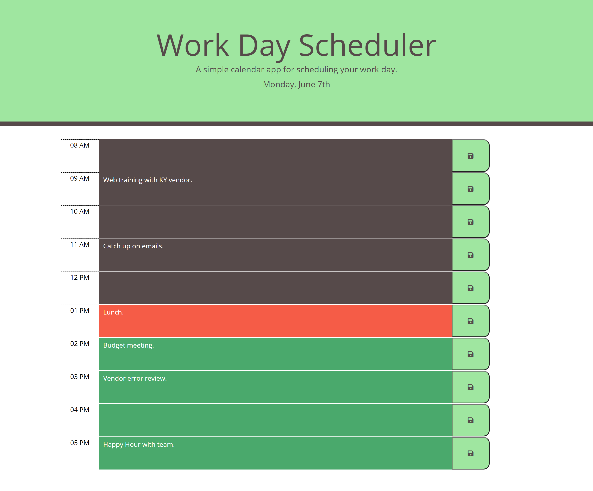
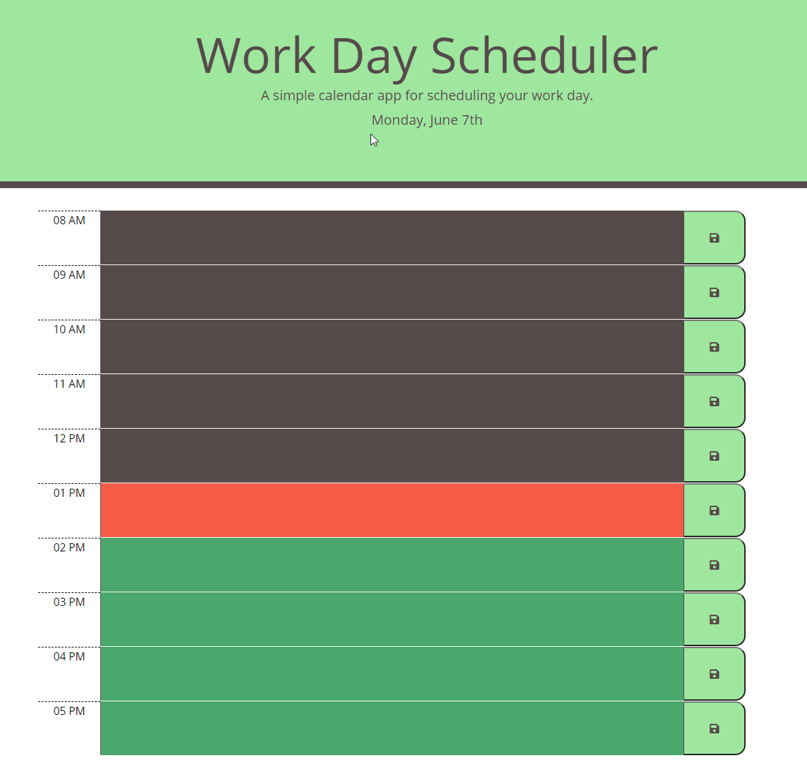

# 05-HW-dayPlanner
A micro planner made in class for scheduling.

[Live site!](https://mmonyok.github.io/05-HW-dayPlanner/)

## Description
- Work can often be hectic, juggling various tasks such as emails, phonecalls, meetings, etc. Planning out your day can reduce stress and anxiety. Organization can always assist with these kinds of problems.
- This web application aims to fix the organizational gap in a busy work day, by providing a simple daily calendar to hold the day's work related activities.
- Think of it as a scratch pad for keeping track of how you want to spend your day.
- Building this web application helped me to better understand local storage and how to utilize the Luxon API.

## Installation
1. Provided that you have a code editor of your choosing installed on your system, such as VS Code (https://code.visualstudio.com/),

2. Provided that you have a Terminal installed for Windows (https://www.microsoft.com/en-us/p/windows-terminal/9n0dx20hk701?rtc=1&activetab=pivot:overviewtab) or are using a Mac with Terminal installed with the OS,

3. You have Git and Github Desktop installed (https://git-scm.com/downloads, https://desktop.github.com/) and have registered for an account,

4. Either Clone or Fork this repository: (https://github.com/mmonyok/05-HW-dayPlanner.git),

5. Create your own repository for the files on GitHub.

6. Edit in your code editor and continue to commit, push changes and perform other Git actions using your repository https://docs.gitlab.com/ee/gitlab-basics/start-using-git.html.

## Usage

## Credits
- Tutorials Followed:
[Professional README guide template provided by Coding Boot Camp.](https://github.com/coding-boot-camp)

- Additional Assets:
[Color palette taken from colorhunt.co; it is color palette #264587.](https://colorhunt.co/palette/282007)

## Badges

